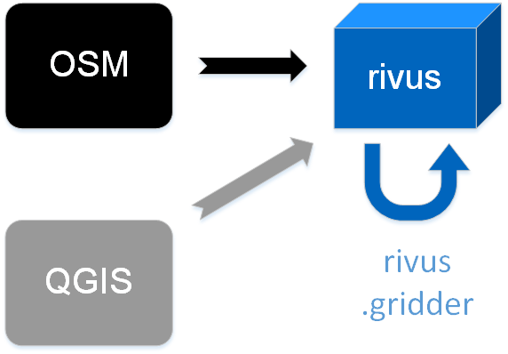

#########
Overview
#########

This section will:

* Get an understanding how ``rivus`` is built up and why.
* Introduce you to the sub packages and direct you to their documentation.
* Clarify what data is expected as input and what you can aspect as output.

.. _a_tutorial:

***********************
Data- and Work-Flows
***********************

Inputs
======

Most generally speaking, for working with ``rivus`` you will need the following inputs:

+ Non-spatial data in a specially formatted Excel spreadsheet.

  - See `Example <https://github.com/tum-ens/rivus/blob/master/data/mnl/data.xlsx>`_
  - Here you can input details about costs, capacities, available commodities etc.
  - Detailed description :ref:`here <a_spreadsheet>`
+ Spatial data

  - We have been using shapefiles but you can use any format which geopandas_ can read.
  - Shapefiles are a somewhat awkward file format, but you can find an included example 
    in `mnl <https://github.com/tum-ens/rivus/tree/master/data/mnl>`_.
  - We await at the an extended version of the files ``vertex`` and an ``edge``.
    Which, exceeding the geometrical information hold additional data. ``vertex`` holds information about
    the maximum available commodity in a source vertex. ``edge`` incorporates the 
    accumulated demand per area (building) type and per edge (street). The demand's unit is
    |m2| as it represents the accumulated base area of different building types.
    This data preparation can be achieved in a run-script before model creation or beforehand
    at data creation.
  - Detailed description: :ref:`vertex <a_vertex>`, :ref:`edge <a_edge>`

.. _geopandas: http://geopandas.org/io.html

  Import possibilities, with Open-source tools.

There are several possibilities to get the spatial input data for ``rivus``,
and conduct analysis on them.

1. Extract data from :abbr:`OSM (OpenStreetMap)` with the help of MapZen_

  - Extensive data preparation is needed for simplifying the geometrical structure
    of the vector layers. (Currently, this work-flow is under maintenance.)
  - Example haag15_ illustrates an extended version of this method.

2. Create vector layers and data manually with a GIS editor. (E.g. QGIS_)

  - Rather applicable for smaller research areas.
  - Mind the snapping settings for vertices and edges!
  - Example `mnl <https://github.com/tum-ens/rivus/tree/master/data/mnl>`_ illustrates the possibility.

3. Use abstract networks from the integrated ``rivus.gridder`` sub-module.

  - It is integrated, so you do not need to care about data preparation. Thus ideal
    for getting familiar with ``rivus``.
  - If using the default, it produces a highly symmetric, homogeneous spatial input.
  - See reference for usage.

.. _haag15: https://github.com/tum-ens/rivus/tree/master/data/haag15
.. _MapZen: https://mapzen.com/data/metro-extracts/
.. _QGIS: http://www.qgis.org/en/site/

Minimalistic Example
======================

If you choose to go with the first or second work-flow, the scripts 
``building_to_edge.py`` and ``streets_to_edge.py`` in the ``rivus.converter`` sub package
can help you. (Even if ``skeletrontools`` may not work for at your environment.)

See helpful gists, for deeper dive.

-  `join data from building.shp and edge.shp`_
-  `OSM street data to vertex.shp and edge.shp`_
-  `Square grid to vertex.shp and edge.shp`_

.. _join data from building.shp and edge.shp: https://gist.github.com/lnksz/6edcd0a877997e9365e808146e9b51fe
.. _OSM street data to vertex.shp and edge.shp: https://gist.github.com/lnksz/7977c4cff9c529ca137b67b6774c60d7
.. _Square grid to vertex.shp and edge.shp: https://gist.github.com/lnksz/bd8ce0a79e499479b61ea7b45d5c661d

Best explained is the second work-flow by the example run-script ``runmin.py``.

Here is a summary, where the main part is done in *10 lines of code*:

.. code-block:: python
  :linenos:
  :emphasize-lines: 7-

  import geopandas as gpd
  from rivus.main.rivus import read_excel, create_model
  from rivus.utils.prerun
  import pyomo.environ
  import pyomo.opt.base import SolverFactory
  ...
  # Non-spatial
  data = read_excel(spreadsheet_path)
  # Spatial
  buildings = gpd.read_file(building_shp_path)
  buildings_grouped = buildings.groupby(['nearest', 'type'])
  total_area = buildings_grouped.sum()['total_area'].unstack()
  edge = gpd.read_file(edge_shp_path).join(total_area)
  vertex = gpd.read_file(vertex_shp_path)
  # Model Creation and Solution
  prob = create_model(data, vertex, edge)
  solver = setup_solver(SolverFactory('glpk'))
  solver.solve(prob, tee=True)

After the last line you have a multitude of opportunities, what you can do with the results.
(A backup of your input parameters is stored in the ``prob.params`` dictionary.)

1. Retrieve results |br|
  ``rivus.main.rivus`` showcase ``get_constants`` and ``get_timeseries`` for that. |br|
  Or you can create a report in a format of an Excel spreadsheet with ``report``.
2. Save the result into an archive. |br|
   (From which you can reload an re-run it.) 
3. Create 2D static or 3D interactive plots. |br|
  ``rivus.main.plot`` or ``rivus.main.result_figures`` expose ``matplotlib`` with all its power (and weaknesses.) |br|
  ``rivus.io.fi3d`` and ``plotly`` will give you the tool for interactive visual data exploration.
4. Conduct graph theoretical analysis on the optimal result networks. |br|
  ``rivus.graph`` holds the adapters so that you  can leverage the opportunities offered by
  mainstream packages like NetworkX_ and python-igraph_.
5. Store your results into a PostgreSQL+PostGIS database. |br|
  ``rivus.io.db`` is all about that.
  As it can be a rather 'scary' thing to jump into database world, a `separate documentation <http://rivus-db.readthedocs.io/en/latest/>`_ was dedicated to help you get started.

.. _NetworkX: https://networkx.github.io/
.. _python-igraph: http://igraph.org/python/
    

*************
Structuring
*************

``rivus`` after version 0.1 became self-contained. Its restructuring is still not
complete, but the sub packages aim to bundle the similar functions together.
Goals to achieve with it:

* Plug-in opportunity for new functionality.
* Smaller, and thus easier maintainable files.
* Easier code re-usability.
* "Structural documentation"

Main - ``rivus.main``
=======================

Core binding to the Pyomo model. The most 'mathematically programmed' part of the code base.

Mathematical documentation
---------------------------

.. todo::
  Extract description from ojdo's thesis

Utils - ``rivus.utils``
=========================

Universal code snippets, which can get handy generally. From setting up solver parameters to parameter range generator,
you can find here the

IO - ``rivus.io``
==================

Plotting - ``rivus.io.plot``
-----------------------------

************
Limitations
************

The works done with ``rivus`` were restricted to the the urban level.
Theoretically, there is no barrier for the model to reach for bigger structures. however,
pragmatically a performance boost would push the project to be more fun to work with bigger or more detailed problems.

As for the current state, ``rivus`` does not consider already existing energy infrastructure networks.
Thus the solution always assumes a "from scratch" planning. (Feature is planned to be developed.)
